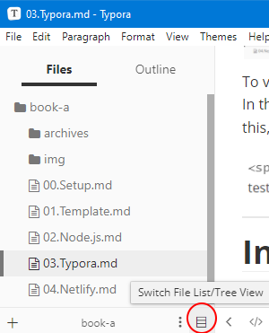

# Typora

Be Aware: Typora is currently free while in Beta testing, however this will change with the release of the official version.

Some features of Typora are not currently compatible with Tutors but will be integrated over time. This includes the functionality mentioned below.

Typora adds additional functionality to the Markdown notation, such as `Highlighting`, `Diagrams`, `Maths`, `Emoji's`, and `Diagrams`. Unlike other editors, Typora is a Markdown only editor, meaning other files such as `properties.yaml` cannot be edited with this application.

However, Typora is unique, allowing the user to view the output of their markdown, as they write it. This greatly reduces the time required for testing page formatting. 

To view the code which is in effect, just click the area which has been formatted. In this example, `Be Aware` is red due to a `` tag, to see the code causing this, just click the content in question; in this case: `Be Aware`.

---

# Installation

1. Follow this link and select the operating system you are using:
    - [Typora Download](https://typora.io/#download)

2. `Install` the application and launch it. 

3. Select `File` -> `Open Folder..`, then select the `tutors-starter` folder.  

   

4. You should see the folder structure open in the sidebar to the left. If the side bar is a `list` rather than a `tree`, select this option at the bottom of the sidebar:

    

5. To set Typora as your default editor for `Markdown` files, navigate to your `tutors-starter` folder in `File Explorer`, then `Right Click` any `Markdown` file and select `Open With..` -> `Choose another app`

    

6. The following window will appear, select `More apps`:

    

7. Scroll down and select `Typora`, also check the box labelled `Always use this app to open .md files`, then select `OK`.

    

You will notice that the icon representing `.md` files is now a Markdown File icon . This means Typora is your default Markdown file editor.

       
